# 🔢 ANN From Scratch — MNIST Digit Recognizer

[](https://github.com/narendrakalam2001/ANN-Scratch-MNIST-Digit-Recognizer/actions)
[](https://python.org)
[](https://numpy.org)
[](https://fastapi.tiangolo.com)
[](https://streamlit.io)
[](tests/test_pipeline_core.py)
[](https://docker.com)
[](LICENSE)

> **Domain:** Deep Learning Fundamentals — Neural Networks from First Principles
> **Problem:** 10-Class Image Classification — handwritten digit recognition, 28×28 grayscale
> **Dataset:** [Kaggle Digit Recognizer (MNIST CSV format)](https://www.kaggle.com/competitions/digit-recognizer/data) — 42,000 labeled training images
> **Interview Context:** Google, Flipkart, and quant-trading firms routinely ask candidates to derive backpropagation on a whiteboard — this project is the proof that the math is understood, not just imported from Keras

---

## 💡 Why This Project Matters

Every other project in this portfolio calls `model.fit()` on a library. This one doesn't call a deep learning
framework at all — **every forward pass, every backpropagated gradient, and every optimizer update is
hand-derived and hand-coded in raw NumPy**:

- **Forward propagation** — manual matrix-multiply chain, numerically stable softmax (subtract row-max before exponentiating)
- **Backpropagation** — the softmax + cross-entropy combined gradient and the full chain-rule derivative, layer by layer, with no autograd
- **Optimizers** — SGD, Momentum, and Adam, all with hand-coded bias-corrected update rules
- **Regularization** — L2 weight decay folded directly into the gradient, plus inverted dropout on hidden layers
- **Everything else in the system is production-grade** — the same champion-challenger promotion, PSI drift
  monitoring, FastAPI serving, and Streamlit dashboard scaffolding used across this entire portfolio

The goal isn't to beat a CNN's accuracy on MNIST — it's to demonstrate that the fundamentals of gradient
descent, weight initialization, and generalization are understood well enough to build a working network
without a framework doing the differentiation.

---

## 🏆 Champion Model Results

Real results from training on the actual Kaggle Digit Recognizer `train.csv` (42,000 rows):

| Metric | Value |
|---|---|
| **Test Accuracy** | `0.9740` |
| **Test Macro F1** | `0.9739` |
| **Train Accuracy** | `0.9937` |
| **Generalization Gap** (train − test) | `0.0196` |
| **Architecture** | `[784, 256, 128, 64, 10]` → selected via 6-trial random search |
| **Hidden Layers (best config)** | `[256, 128]` |
| **Activation** | ReLU (hidden) → Softmax (output) |
| **Optimizer** | Adam, lr=0.01 with 0.97/epoch decay |
| **Epochs Trained** | `22 / 40` (early stopping, patience=5 on val_loss) |
| **Weight Init** | He initialization |
| **Champion Model** | `ANN_Scratch_v1` |

Full per-digit precision/recall/F1 breakdown: see `ann_models/model_card_ANN_Scratch_v1.json` and
[`docs/plots/per_class_f1.png`](docs/plots/per_class_f1.png).

---

## 🔗 Live Links

| Service | URL |
|---|---|
| 🚀 **FastAPI (Swagger UI)** | `http://localhost:8000/docs` (local) |
| 📊 **Monitoring Dashboard** | `http://localhost:8501` (local) |
| 📓 **EDA Notebook** | [notebooks/mnist_ann_eda.ipynb](notebooks/mnist_ann_eda.ipynb) |

> Not yet deployed to Render/Streamlit Cloud — `render.yaml` is included and ready; update this section
> with live URLs once deployed.

---

## 🏗️ System Architecture

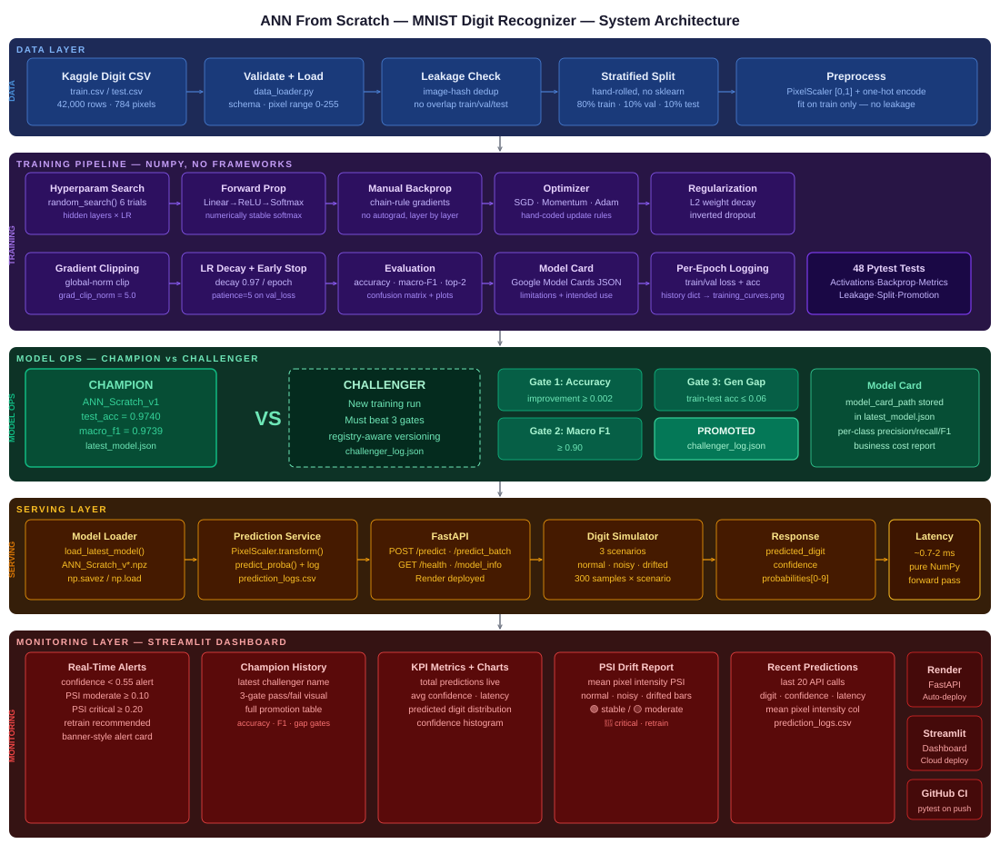

```
╔══════════════════════════════════════════════════════════════════════════════════╗
║        ANN FROM SCRATCH — MNIST DIGIT RECOGNIZER — 5-LAYER SYSTEM                ║
╠══════════════════════════════════════════════════════════════════════════════════╣
║                                                                                  ║
║  ┌─────────────────────────────── DATA LAYER ──────────────────────────────┐     ║
║  │  Kaggle CSV → Validate + Load → Leakage Check → Stratified Split →       │     ║
║  │  Preprocess (PixelScaler [0,1] + one-hot)                                │     ║
║  │  42,000 rows · 784 pixels · 80/10/10% split, fit on train only           │     ║
║  └───────────────────────────────────┬─────────────────────────────────────┘     ║
║                                      ▼                                           ║
║  ┌─────────────────────── TRAINING PIPELINE (NumPy) ───────────────────────┐     ║
║  │                                                                         │     ║
║  │  Hyperparam Search → Forward Prop → Manual Backprop → Optimizer →       │     ║
║  │  Regularization → Gradient Clipping → LR Decay + Early Stop             │     ║
║  │                                                                         │     ║
║  │  random_search() 6 trials · He init · Adam · L2 + dropout               │     ║
║  │  grad_clip_norm=5.0 · decay=0.97/epoch · patience=5                     │     ║
║  │                                                                         │     ║
║  │  CHAMPION → ANN_Scratch_v1  test_acc=0.9740  macro_f1=0.9739            │     ║
║  └───────────────────────────────────┬─────────────────────────────────────┘     ║
║                                      ▼                                           ║
║  ┌──────────────────────── CHAMPION-CHALLENGER ────────────────────────────┐     ║
║  │                                                                         │     ║
║  │  Gate 1: accuracy improvement  ≥ 0.002  →  ✅ PASS / ❌ FAIL            │     ║
║  │  Gate 2: macro F1              ≥ 0.90   →  ✅ PASS / ❌ FAIL            │     ║
║  │  Gate 3: train-test acc gap    ≤ 0.06   →  ✅ PASS / ❌ FAIL            │     ║
║  │                                                                         │     ║
║  │  ALL gates pass → PROMOTED (latest_model.json updated)                  │     ║
║  │  ANY gate fails → REJECTED (champion retained, result logged)           │     ║
║  └───────────────────────────────────┬─────────────────────────────────────┘     ║
║                                      ▼                                           ║
║  ┌──────────────────────────── SERVING LAYER ──────────────────────────────┐     ║
║  │                                                                         │     ║
║  │  Model Loader → Prediction Service → FastAPI                            │     ║
║  │                                                                         │     ║
║  │  POST /predict       → 784 pixel values → digit + confidence            │     ║
║  │  POST /predict_batch → multiple images at once                          │     ║
║  │  GET  /health        → {status, model_loaded}                           │     ║
║  │  GET  /model_info    → champion registry + model card                   │     ║
║  └───────────────────────────────────┬─────────────────────────────────────┘     ║
║                                      ▼                                           ║
║  ┌─────────────────── MONITORING LAYER — STREAMLIT DASHBOARD ──────────────┐     ║
║  │                                                                         │     ║
║  │  Section 1: Real-Time Alerts    → low confidence · PSI critical drift   │     ║
║  │  Section 2: Champion-Challenger → decision · 3-gate status · history    │     ║
║  │  Section 3: KPIs + Charts       → total predictions · digit distribution│     ║
║  │  Section 4: PSI Drift           → normal/noisy/drifted scenario bars    │     ║
║  │  Section 5: Recent Predictions  → last 20 API calls, audit log          │     ║
║  │  Sidebar:   Predict a Digit     → upload a real 28×28 digit image       │     ║
║  │                                                                         │     ║
║  │  Simulator: 3 scenarios (normal · noisy · drifted) → hits /predict      │     ║
║  └─────────────────────────────────────────────────────────────────────────┘     ║
╚══════════════════════════════════════════════════════════════════════════════════╝
```

---

## 📸 Dashboard Screenshots

### 🖥️ Full Dashboard UI

Real-time digit prediction dashboard — live sidebar prediction · Champion-Challenger system · KPI cards · PSI drift · recent-predictions audit log.

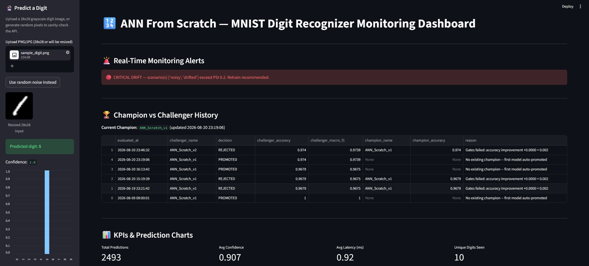

---

### 📊 KPIs & Prediction Charts

Total predictions, average confidence, average latency, and unique digits seen · predicted-digit distribution and confidence-score histogram.

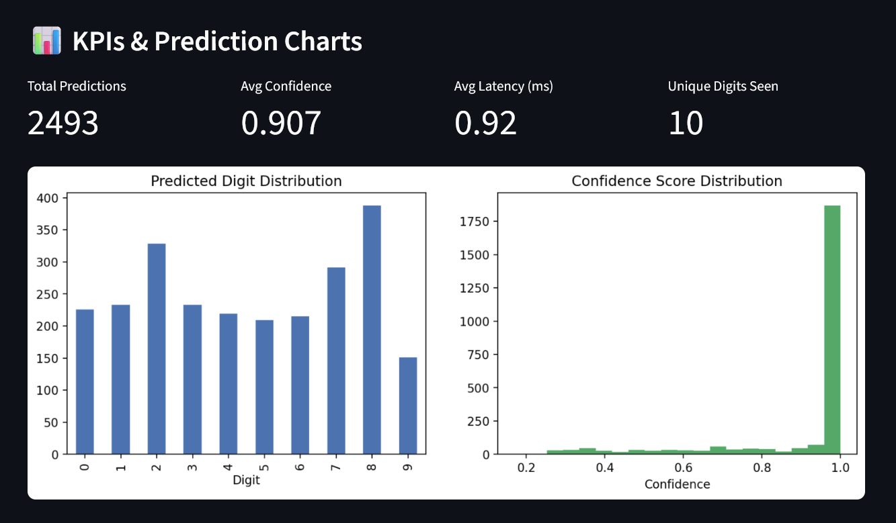

---

### 📈 PSI Drift Monitoring

Population Stability Index on mean-pixel-intensity per image, across the simulator's three traffic scenarios — colour-coded thresholds.

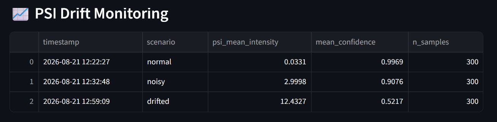

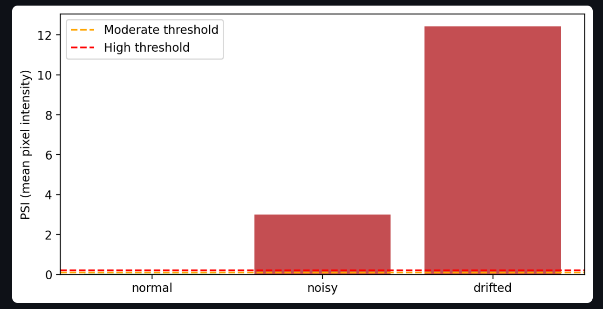

---

### 📋 Recent Predictions Log

Last 20 API predictions — predicted digit, confidence, mean pixel intensity, latency, and model name.

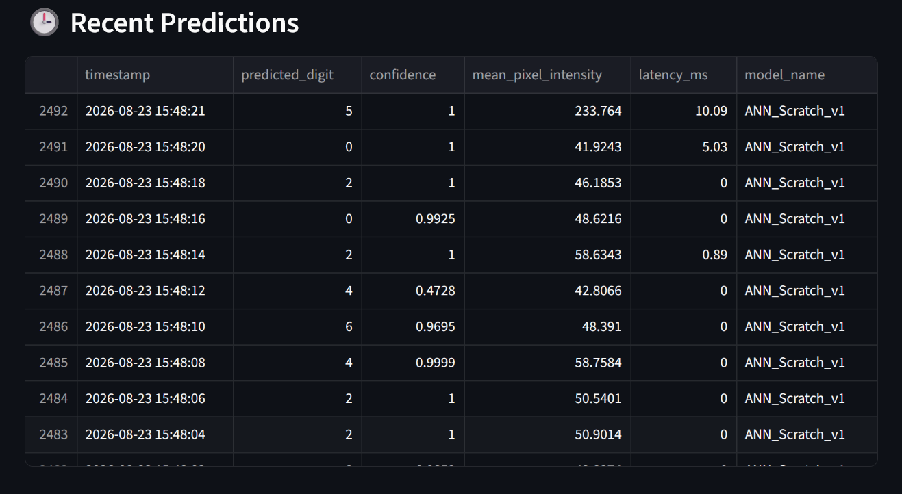

---

## 📊 Training Reports

| Confusion Matrix | Per-Class F1 |
|---|---|
| 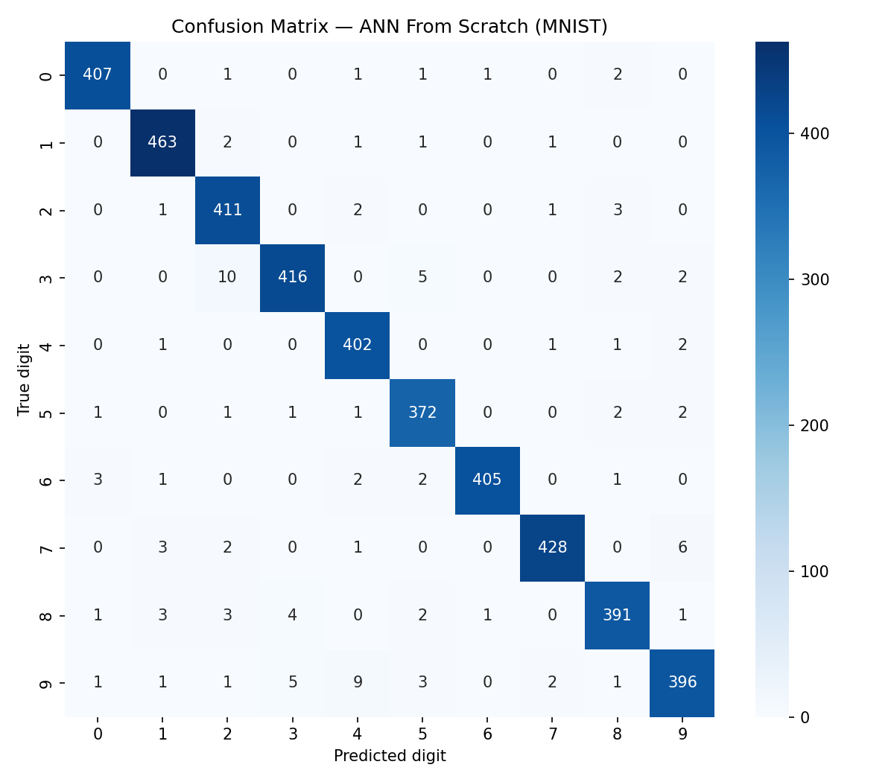 | 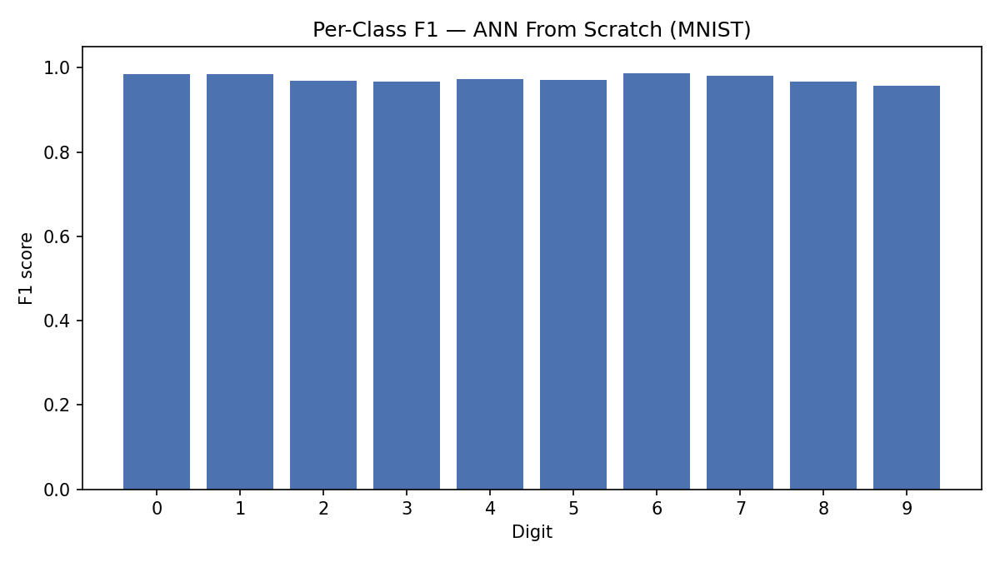 |

| Training Curves | Misclassified Samples |
|---|---|
| 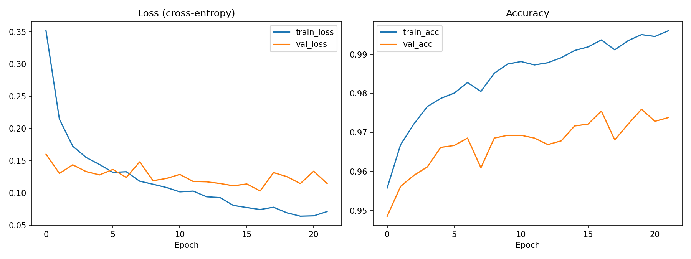 | 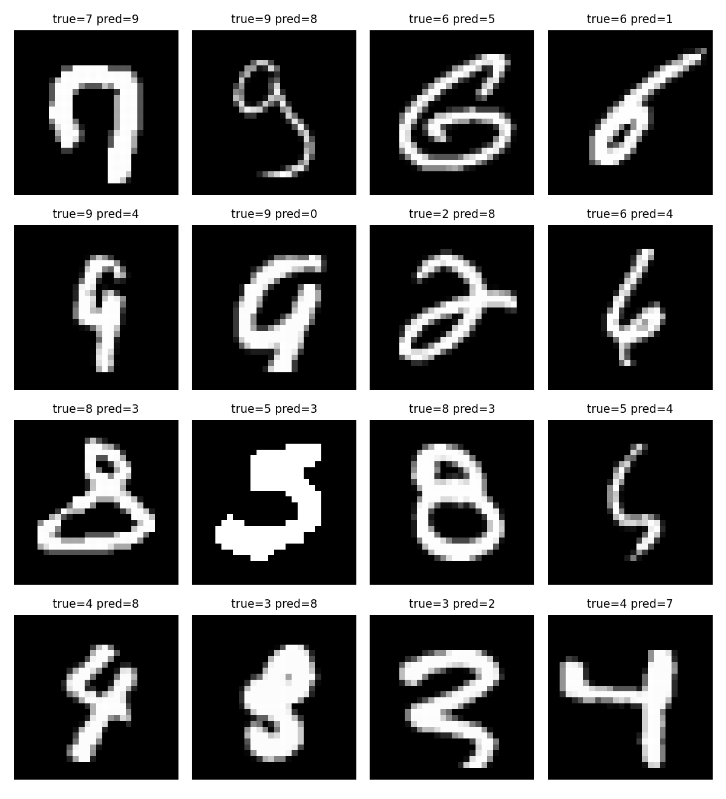 |

| Test Coverage | Simulation Run |
|---|---|
| 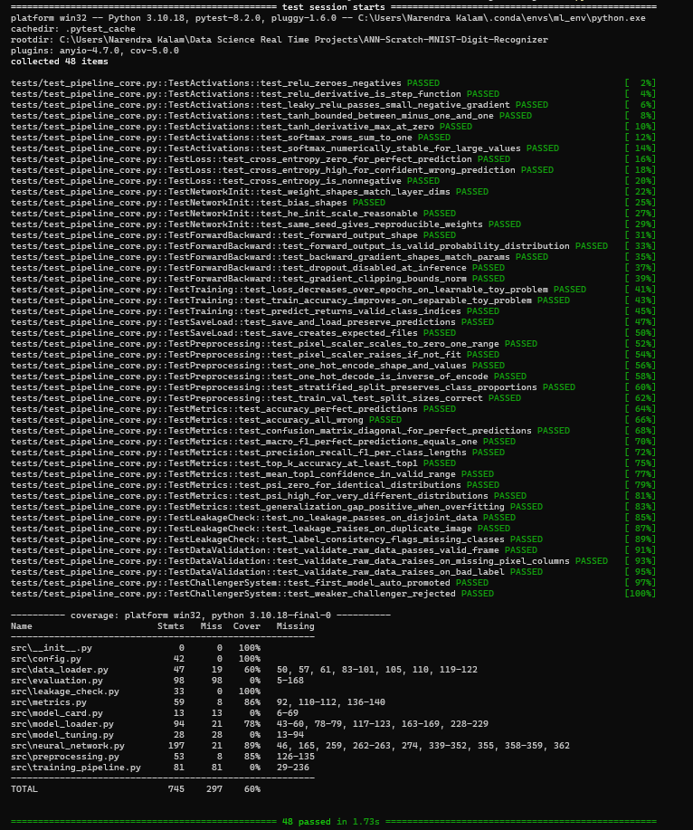 | 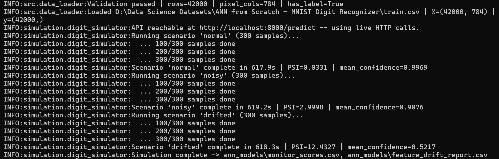 |

| Training & Evaluation Summary |
|---|
| 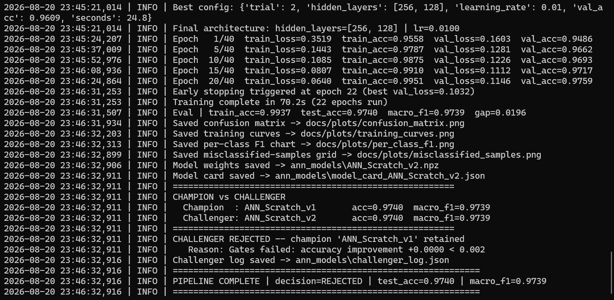 |

---

## 🎬 System Demo

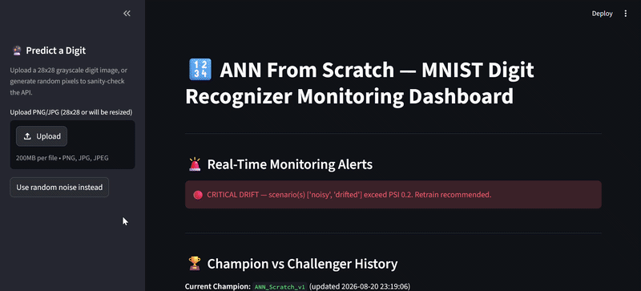

---

## 📁 Project Structure

```
ANN-Scratch-MNIST-Digit-Recognizer/
│
├── src/                                    # Core ML system — pure NumPy
│   ├── config.py                           # All hyperparameters, thresholds, gates
│   ├── data_loader.py                      # Kaggle CSV loader + schema/range validation
│   ├── preprocessing.py                    # PixelScaler · one-hot · stratified split (hand-rolled)
│   ├── neural_network.py                   # THE from-scratch ANN — forward/backward/optimizers
│   ├── model_tuning.py                     # random_search() over architecture + learning rate
│   ├── metrics.py                          # accuracy · macro-F1 · top-k · PSI · cost report
│   ├── evaluation.py                       # full eval + confusion matrix / curves / F1 plots
│   ├── leakage_check.py                    # image-hash duplicate detection across splits
│   ├── model_card.py                       # Google Model Cards standard JSON
│   ├── model_loader.py                     # Champion-Challenger 3-gate promotion system
│   └── training_pipeline.py               # End-to-end training orchestration
│
├── serving/
│   └── mnist_digit_api.py                 # FastAPI: /predict · /predict_batch · /health · /model_info
│
├── services/
│   └── prediction_service.py              # Pixel scaling → predict_proba() → logs prediction
│
├── monitoring/
│   └── monitoring_dashboard.py            # Streamlit: 5-section monitoring dashboard
│
├── simulation/
│   └── digit_simulator.py                 # 3-scenario traffic simulator (normal · noisy · drifted)
│
├── tests/
│   └── test_pipeline_core.py              # 48 pytest unit tests — all passing
│
├── scripts/
│   ├── train_model.py                     # python scripts/train_model.py [--no-tuning] [--version vN]
│   ├── run_api.py                         # python scripts/run_api.py
│   ├── run_dashboard.py                   # python scripts/run_dashboard.py
│   └── run_simulation.py                  # python scripts/run_simulation.py
│
├── notebooks/
│   └── mnist_ann_eda.ipynb                # 20-step professional EDA notebook
│
├── extract_sample_image.py                # Pulls a real digit row from the CSV → PNG for dashboard upload
│
├── data/
│   ├── train.csv                          # Kaggle Digit Recognizer training data (download separately)
│   └── sample_digit.png                   # Sample real digit extracted for dashboard demo/testing
│
├── ann_models/                            # Model artifacts — registry-based, versioned
│   ├── latest_model.json                  # Champion model registry
│   ├── challenger_log.json                # Full Champion-Challenger comparison history
│   ├── model_card_ANN_Scratch_v*.json     # Google Model Card JSON per version
│   ├── ANN_Scratch_v*.npz                 # Model weights (NumPy arrays)
│   ├── monitor_scores.csv                 # Simulator prediction log
│   └── feature_drift_report.csv           # PSI drift per scenario
│
├── docs/
│   ├── architecture/
│   │   └── system_architecture.svg        # 5-layer system architecture diagram
│   ├── plots/
│   │   ├── confusion_matrix.png           # 10×10 confusion matrix heatmap
│   │   ├── per_class_f1.png               # Per-digit F1 bar chart
│   │   ├── training_curves.png            # Loss + accuracy per epoch
│   │   └── misclassified_samples.png      # Grid of misclassified digits, true vs predicted
│   ├── screenshots/
│   │   ├── dashboard_full_ui.png          # Full Streamlit dashboard UI
│   │   ├── kpis_&_prediction_charts.png   # KPI cards + distribution charts
│   │   ├── psi_drift.png                  # PSI drift bar chart
│   │   ├── psi_monitoring.png             # PSI monitoring table
│   │   └── recent_predictions.png         # Recent predictions audit log
│   ├── reports/
│   │   ├── simulation.png                 # Simulation run terminal output
│   │   ├── test_coverage.png              # pytest 48/48 coverage report
│   │   └── training_model_summary.png     # Training summary
│   └── gifs/
│       └── system_demo.gif                # End-to-end system demo
│
├── logs/
│   └── prediction_logs.csv                # API prediction audit log (auto-generated)
│
├── Dockerfile                             # FastAPI production image
├── Dockerfile.dashboard                   # Streamlit dashboard container
├── docker-compose.yml                     # API + Dashboard (ports 8000 + 8501)
├── .github/workflows/ci.yml              # GitHub Actions — pytest on every push
├── .gitignore
├── .dockerignore
├── README.md                              # This file
├── render.yaml                            # Render.com deployment config
├── requirements.txt                       # Core dependencies
├── requirements_api.txt                   # + FastAPI/uvicorn
├── requirements_dashboard.txt             # + Streamlit/requests/pillow
└── runtime.txt                            # Python 3.12.3
```

---

## 🚀 Quickstart

### 1. Clone & Install

```bash
git clone https://github.com/narendrakalam2001/ANN-Scratch-MNIST-Digit-Recognizer.git
cd ANN-Scratch-MNIST-Digit-Recognizer
pip install -r requirements.txt
```

### 2. Download Dataset

Download [Kaggle Digit Recognizer](https://www.kaggle.com/competitions/digit-recognizer/data) → place `train.csv` in `data/`

```
data/
└── train.csv        # 42,000 rows · label + pixel0..pixel783
```

> Kaggle's dataset is pure tabular pixel data — there are no image files. Use
> `extract_sample_image.py` (see below) to pull a real digit out as a PNG for the dashboard demo.

### 3. Train Model

```bash
python scripts/train_model.py                # with hyperparameter search (6 trials)
python scripts/train_model.py --no-tuning     # skip search, use config.py defaults — faster
```

Expected output:
```
INFO  Validation passed | rows=42000 pixel_cols=784 has_label=True
INFO  Split sizes | train=33601 val=4199 test=4200
INFO  Leakage check passed — no duplicate images across train/val/test
INFO  Best config: hidden_layers=[256, 128] learning_rate=0.01
INFO  Early stopping triggered at epoch 22 (best val_loss=0.1032)
INFO  Eval | train_acc=0.9937 test_acc=0.9740 macro_f1=0.9739 gap=0.0196
INFO  PIPELINE COMPLETE | decision=PROMOTED
```

### 4. Extract a Real Digit for Testing

```bash
python extract_sample_image.py --file data/train.csv --index 0 --out sample_digit.png
```

### 5. Start API

```bash
python scripts/run_api.py
# API:  http://localhost:8000
# Docs: http://localhost:8000/docs
```

### 6. Start Dashboard

```bash
python scripts/run_dashboard.py
# Dashboard: http://localhost:8501
```

Upload `sample_digit.png` in the sidebar "Predict a Digit" panel to test the live model with a real image.

### 7. Run Simulation

```bash
python scripts/run_simulation.py
# Runs 3 scenarios (normal · noisy · drifted) against the live API, 300 samples each
```

### 8. Run Tests

```bash
pytest tests/ -v --cov=src --cov-report=term-missing
# 48 collected · 48 passed
```

---

## 🐳 Docker

```bash
# Start everything
docker-compose up --build

# API only
docker-compose up api

# Dashboard only
docker-compose up dashboard

# Stop
docker-compose down
```

| Service | URL |
|---|---|
| FastAPI + Swagger | `http://localhost:8000/docs` |
| Streamlit Dashboard | `http://localhost:8501` |

---

## 🌐 API Reference

### POST /predict — Single Digit Prediction

```bash
curl -X POST "http://localhost:8000/predict" \
  -H "Content-Type: application/json" \
  -d "{\"pixels\": [0, 0, 0, ...784 values...]}"
```

**Response:**
```json
{
  "predicted_digit": 2,
  "confidence": 0.9998,
  "probabilities": {
    "0": 0.0, "1": 0.0, "2": 0.9998, "3": 0.0, "4": 0.0001,
    "5": 0.0, "6": 0.0, "7": 0.0, "8": 0.0, "9": 0.0
  },
  "latency_ms": 0.71,
  "model_name": "ANN_Scratch_v1",
  "latency_seconds": 0.0009
}
```

### POST /predict_batch

```bash
curl -X POST "http://localhost:8000/predict_batch" \
  -H "Content-Type: application/json" \
  -d "{\"images\": [[...784 values...], [...784 values...]]}"
```

### GET /health

```json
{"status": "running", "model_loaded": true}
```

### GET /model_info

Returns the champion registry plus full model card JSON — architecture, metrics, thresholds, limitations.

---

## 🏆 Champion vs Challenger — 3-Gate Promotion

Every new training run is compared against the production champion using **3 promotion gates**:

| Gate | Condition | Rationale |
|---|---|---|
| Accuracy Improvement | Challenger must beat champion by ≥ 0.002 | Meaningful accuracy gain only, not noise |
| Macro F1 Threshold | ≥ 0.90 | Minimum viable multi-class performance |
| Generalization Gap | train − test accuracy ≤ 0.06 | No overfitting relative to the champion |

> **Why registry-aware versioning matters:** every training run is saved under a distinct auto-incrementing
> version (`ANN_Scratch_v1`, `v2`, `v3`, ...) computed from both the files on disk *and* the current
> registry pointer — so a new challenger's weights and model card can never silently collide with or
> overwrite the current champion's artifacts before the comparison runs.

Results are logged to `ann_models/challenger_log.json` and visible in the dashboard's Section 2 with
per-gate status and full promotion history.

---

## 🧠 Technical Standards

| Component | Implementation |
|---|---|
| **Network** | Fully-connected feed-forward — `[784, 256, 128, 64, 10]`, all layers hand-coded in NumPy |
| **Weight Init** | He initialization (ReLU-appropriate) / Xavier (tanh) |
| **Forward Prop** | Manual matrix chain, numerically stable softmax (row-max subtraction) |
| **Backprop** | Manual chain-rule gradients, layer by layer — no autograd |
| **Optimizers** | SGD · Momentum · Adam — all hand-coded, bias-corrected update rules |
| **Regularization** | L2 weight decay (folded into gradient) + inverted dropout |
| **Gradient Clipping** | Global-norm clipping, `grad_clip_norm=5.0` |
| **LR Schedule** | Multiplicative decay 0.97/epoch + early stopping (patience=5 on val_loss) |
| **Hyperparameter Search** | Random search — 6 trials over hidden-layer shape × learning rate |
| **Data Split** | Hand-rolled stratified split — 80/10/10% train/val/test, no sklearn |
| **Leakage Detection** | Image-hash duplicate check across all three splits, run before training |
| **Drift Monitoring** | PSI on mean pixel intensity per image — edge-based, correct bucket implementation |
| **Model Card** | Google Model Cards standard — JSON with limitations + intended use |
| **Champion-Challenger** | 3-gate: accuracy improvement ≥ 0.002 · macro F1 ≥ 0.90 · gap ≤ 0.06 |
| **CI/CD** | GitHub Actions — pytest on every push |
| **Deployment** | Render.com (FastAPI) + Streamlit Cloud (Dashboard) — config included, not yet deployed |

---

## 📈 Monitoring Dashboard — 5 Sections

| Section | What it shows |
|---|---|
| **1. Real-Time Alerts** | Mean confidence < 0.55 · PSI ≥ 0.10 moderate / ≥ 0.20 critical drift |
| **2. Champion-Challenger** | Current champion badge · full promotion history table |
| **3. KPIs + Charts** | Total predictions · avg confidence · avg latency · digit distribution · confidence histogram |
| **4. PSI Drift** | Per-scenario PSI on mean pixel intensity · colour-coded stable/moderate/critical |
| **5. Recent Predictions** | Last 20 API calls · digit · confidence · latency · model name |
| **Sidebar** | Predict a Digit — upload a real 28×28 image → instant prediction + probability bar chart |

---

## 🧪 Test Coverage

```
48 tests collected across 11 test classes:

  TestActivations       (7)  — ReLU · Leaky ReLU · tanh · softmax (incl. numerical stability)
  TestLoss               (3)  — cross-entropy: zero for perfect pred · high for confident-wrong · non-negative
  TestNetworkInit         (4)  — weight/bias shapes · He-init scale · seed reproducibility
  TestForwardBackward      (5)  — output shape · valid probability dist · gradient shapes · dropout ·
                                  gradient clipping bounds
  TestTraining              (3)  — loss decreases · train accuracy improves · valid class predictions
  TestSaveLoad                (2)  — save/load preserves predictions · expected files created
  TestPreprocessing             (6)  — PixelScaler range · unfit-transform guard · one-hot encode/decode ·
                                       stratified split · train/val/test split sizes
  TestMetrics                    (10) — accuracy · confusion matrix · macro-F1 · top-k · confidence ·
                                        PSI (identical/shifted distributions) · generalization gap
  TestLeakageCheck                 (3)  — no leakage on disjoint data · duplicate detection · label
                                          consistency
  TestDataValidation                 (3)  — valid frame passes · missing pixel columns raises · bad label
                                            raises
  TestChallengerSystem                 (2)  — first model auto-promoted · weaker challenger rejected

Result: 48 passed · 0 failed
```


---

## 📊 Business Impact Framing

`src/metrics.py::misclassification_cost_report` translates raw test-set error rate into an illustrative
daily-volume cost estimate — the same cost-sensitive framing used across this portfolio's fraud and credit
risk projects:

| Metric | Value |
|---|---|
| Test error rate | `1 − 0.9740 = 0.026` (2.6%) |
| Illustrative daily volume (e.g. cheque/form digit reads) | `100,000` |
| Estimated daily misreads at this error rate | `~2,600` |

> These are illustrative, not sourced business figures — unlike the domain-specific pricing benchmarks in
> this portfolio's healthcare/BFSI projects, MNIST digit recognition has no established per-scan cost
> baseline. The framing shows *how* the pipeline would translate accuracy into operational cost in a real
> digitization pipeline (form/cheque OCR), where every misread routes to manual review.

---

## ⚠️ Limitations & Ethical Considerations

- **No convolutional structure** — spatial locality (why adjacent pixels correlate) is *learned* through
  fully-connected weights, not built into the architecture the way a CNN's receptive fields would
- Trained and evaluated only on the Kaggle Digit Recognizer CSV distribution — centered, cropped,
  black-background digits; performance on rotated, off-center, or naturally photographed digits is
  untested
- Confusable digit pairs (4/9, 3/5/8, 7/1) remain the model's hardest cases — see
  `docs/plots/confusion_matrix.png` and `docs/plots/misclassified_samples.png` for exactly where errors
  concentrate
- In any real deployment (form/cheque digitization), low-confidence predictions should route to human
  review rather than auto-accept — the dashboard's confidence-alert threshold (0.55) exists for this
  reason
- Full limitations and intended-use documentation: `ann_models/model_card_ANN_Scratch_v1.json`, generated
  automatically per training run per the Google Model Cards standard

---

## 👨‍💻 About

**Narendra Kalam** — MSc Computer Science (Gold Medalist — NASSCOM, Full Stack Data Science + AI)

> Building 20+ industry-level, end-to-end ML systems across all domains.

[](https://www.linkedin.com/in/narendra-kalam/)
[](https://www.kaggle.com/narendrakalam)
[](https://narendrakalam2001.github.io/)
[](mailto:kalamnarendra2001@gmail.com)

### Portfolio Projects

| # | Project | Domain | Champion Model | Key Metric |
|---|---|---|---|---|
| 1 | Credit Card Fraud Detection | BFSI / Fintech | ExtraTrees | F1 = 0.8962 · 284K transactions |
| 2 | Credit Risk Prediction | BFSI / Lending | LightGBM | F1 = 0.9741 · ROC-AUC = 0.9991 |
| 3 | Customer Churn Prediction | Telecom / BFSI | — | BFSI domain |
| 4 | Store Sales Forecasting | Retail / Supply Chain | — | Kaggle competition |
| 5 | **ANN From Scratch — MNIST Digit Recognizer** | **Deep Learning Fundamentals** | **From-scratch ANN** | **Test Acc = 0.9740 · Macro F1 = 0.9739** |

---

## 📚 References

- LeCun et al. (1998) — [Gradient-Based Learning Applied to Document Recognition](http://yann.lecun.com/exdb/publis/pdf/lecun-01a.pdf)
- Kingma & Ba (2014) — [Adam: A Method for Stochastic Optimization](https://arxiv.org/abs/1412.6980)
- He et al. (2015) — [Delving Deep into Rectifiers: Surpassing Human-Level Performance on ImageNet Classification](https://arxiv.org/abs/1502.01852)
- Kaggle Digit Recognizer — [Competition Page](https://www.kaggle.com/competitions/digit-recognizer/data)

---

## 📄 License

MIT License — see [LICENSE](LICENSE)